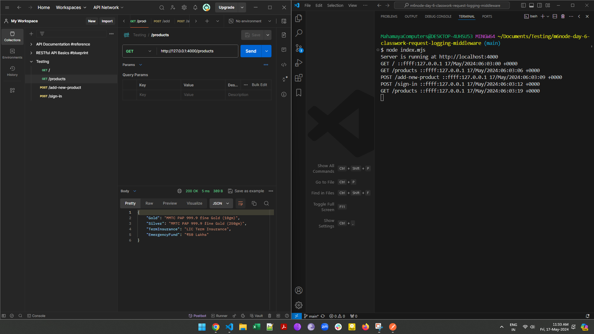

# Request Logging Middleware (Day 6 Homework, Module #6, MERN Stack)


## Description:
In this assignment, i have developed a Node.js application using Express and implemented [Morgan](https://www.npmjs.com/package/morgan) middleware for logging details about incoming requests. This middleware will capture essential information such as:
+ the request method,
+ URL, 
+ IP address, and
+ timestamps
thus providing insights about the traffic received by application.

## Key Learning Objectives:
+ Understanding the role of middleware in request processing pipelines.
+ Implementing custom middleware functions to capture and log request details.
+ Utilizing logging libraries like [Morgan](https://www.npmjs.com/package/morgan) for advanced logging capabilities.
+ Exploring different logging levels (e.g., info, debug) to control the verbosity of logs.

## How to install and run in yours local machine
```bash
npm install
npm run start
```

## API End Point #1
```javascript
GET /
```

### API Response Example
```
Logging using Morgan Middleware!
```

## API End Point #2
```javascript
GET /products
```

### API Response Example
```javascript
{
    "Gold": "MMTC PAP 999.9 fine Gold (10gm)",
    "Silver": "MMTC PAP 999.9 fine Gold (250gm)",
    "TermInsurance": "LIC Term Insurance",
    "EmergencyFund": "₹50 Lakhs"
}
```

## API End Point #3
```javascript
GET /add-new-product

example body:
{
    "productName": "World Tour",
    "description": "Tour around the world!"
}
```

### API Response Example
```bash
product: "World Tour" shall be added after approval!
```

## API End Point #4
```javascript
GET /sign-in

example body:
{
    "email": "admin@alex21c.com",
    "password": "admin123"
}
```

### API Response Example
```
okay, let me write sign-in logic before!
```

## Tech. Stack Used:
+ [NodeJS](https://nodejs.org/en/) 
+ [ExpressJS](https://expressjs.com/) 

## Author
[Abhishek kumar](https://www.linkedin.com/in/alex21c/), ([Geekster](https://geekster.in/) MERN Stack FS-14 Batch)


